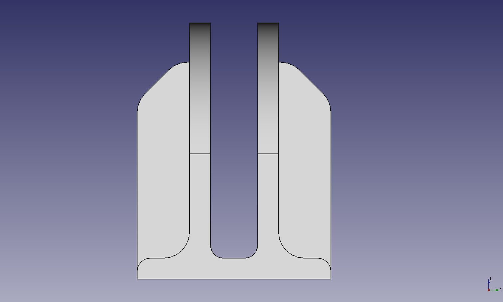
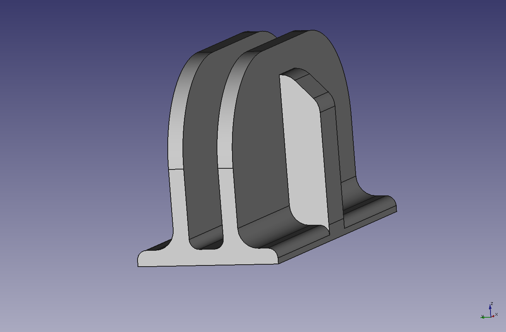
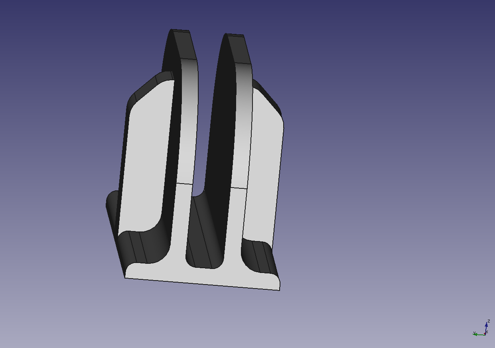

# 3D Printed vertical stand

3D Printed Vertical Stand for the Lenovo T14S Gen1

## Printer used

**Printer:** bq Prusa i3 hephestos 
**Rafts:** No 
**Supports:** No 
**Resolution:** 0.2mm 
**Infill:** 8% 
**Filament:** Sakata PLA

## Snapshots and photos

## Thingiverse

[Published in Thingiverse](https://www.thingiverse.com/thing:5235496)

## License

This work is under [Creative Commons Attribution-ShareAlike 4.0 International License](http://creativecommons.org/licenses/by-sa/4.0/).

Please read the [LICENSE](LICENSE) file for more details.
